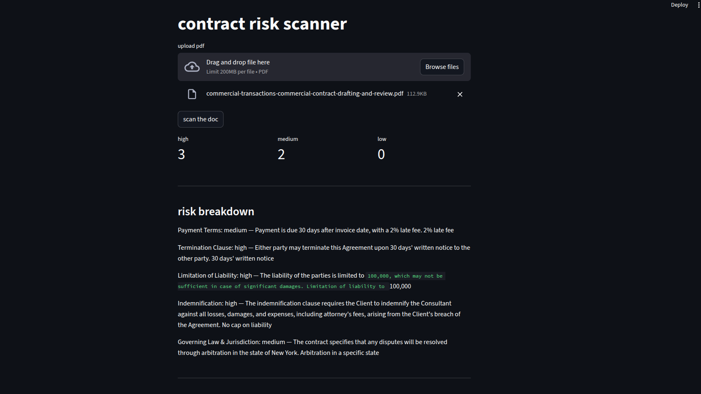

# Contract Risk Scanner

A document analysis tool that scans uploaded contracts for risky clauses and returns a structured risk report. Built as an evolution of my earlier [Fact Verification RAG Assistant (Hybrid Search Edition)](https://github.com/krishagarwal314/Fact-Verification-RAG-Assistant-Hybrid-Search-Edition-), with two key architectural differences explained below.

---

## What It Does

Upload a contract PDF. The system scans it for five risk categories and returns a structured breakdown:



```
Payment Terms:            medium — Payment is due 30 days after invoice date, with a 2% late fee.
Termination Clause:       high   — Either party may terminate upon 30 days' written notice.
Limitation of Liability:  high   — Liability capped at $100,000, may be insufficient for significant damages.
Indemnification:          high   — Client indemnifies Consultant against all losses. No cap on liability.
Governing Law:            medium — Disputes resolved through arbitration in the state of New York.
```

---

## Risk Categories

| Category | What It Flags |
|---|---|
| Payment Terms | Net 90+, unusual due dates, late payment penalties |
| Termination Clause | Missing clause, short or unreasonable notice periods |
| Limitation of Liability | No cap, low cap, unlimited exposure |
| Indemnification | One-sided clauses, no liability cap, broad scope |
| Governing Law & Jurisdiction | Unfavorable jurisdiction, arbitration-only clauses |

---

## How It Works

```
PDF Upload
   ↓
Chunk (800 , 150 overlap) via RecursiveCharacterTextSplitter
   ↓
BM25Encoder.fit(chunks)       → sparse vectors (fitted on this document)
HuggingFace all-MiniLM-L6-v2 → dense vectors (384d)
   ↓
Pinecone Hybrid Index (dotproduct metric, per-session namespace)
   ↓
For each risk category:
   keyword-dense retrieval query → PineconeHybridSearchRetriever (alpha=0.15)
   top-5 chunks → Groq LLaMA 3.1 8B Instant
   structured JSON output: { found, risk_level, summary, flag }
   ↓
Aggregated Risk Report: { high, medium, low } + per-clause breakdown
```

---

## Key Design Decisions

### 1. alpha = 0.15 (vs 0.35 in the previous project)

The previous project (Fact Verification RAG Assistant) used `alpha=0.35` — a 35/65 split between semantic and keyword search. That worked well for general document Q&A where meaning matters as much as exact terms.

Contracts are different. Legal language is precise and non-negotiable — "indemnification", "governing law", "limitation of liability" are exact clause names, not concepts that can be paraphrased. A retriever that leans on semantic similarity risks returning loosely related passages instead of the actual clause. With `alpha=0.15`, the retriever is 85% keyword-driven, which is the right tradeoff for legal documents.

### 2. Keyword-dense retrieval queries (not user queries)

Each risk category has a crafted retrieval query designed for BM25 matching, not natural language:

```python
"payment_terms": "payment terms invoice due date net 30 net 60 net 90 late payment interest billing schedule"
```

These are not questions — they are normalized, keyword-dense strings that maximize term overlap with how legal clauses are actually written. BM25Encoder handles internal text normalization (tokenization, stopword removal, term frequency weighting) when fitted on the document corpus. This approach consistently outperforms asking the retriever a natural language question like "what are the payment terms?" for domain-specific legal retrieval.


### 3. Structured JSON output per clause

Instead of a free-form answer, the LLM is prompted to return a fixed schema for every category:

```json
{
  "found": true,
  "risk_level": "high",
  "summary": "Client indemnifies Consultant against all losses including attorney fees.",
  "flag": "No cap on liability"
}
```

This makes the output programmatically usable — countable, filterable, exportable — rather than just readable.

### 4. Per-session Pinecone namespaces

Each upload gets a `uuid4()` namespace in Pinecone. Multiple users can upload different contracts simultaneously without their vectors colliding in the same index.

---

## Tech Stack

| Tool | Role |
|---|---|
| FastAPI | Backend API (`/upload`, `/scan`) |
| Streamlit | Frontend UI |
| Pinecone | Cloud vector DB with hybrid (dense + sparse) index |
| BM25Encoder | Sparse keyword vectors, fitted on document corpus |
| HuggingFace all-MiniLM-L6-v2 | Dense semantic embeddings (384d) |
| PineconeHybridSearchRetriever | Combines dense + sparse with `alpha=0.15` |
| Groq + LLaMA 3.1 8B Instant | Fast structured JSON extraction |
| LangChain | Chains prompt → LLM → JsonOutputParser |

---

## Setup

```bash
pip install -r requirements.txt
```

Create `.env`:
```
GROQ_API_KEY=your_groq_key
pinecone_key=your_pinecone_key
```

Run backend:
```bash
uvicorn app2:app --reload
```

Run frontend:
```bash
streamlit run frontend.py
```

---

## Project Structure

```
.
├── backend.py          # FastAPI backend
├── frontend.py      # Streamlit frontend
├── requirements.txt
├── .env             # API keys (not committed)
└── README.md
```